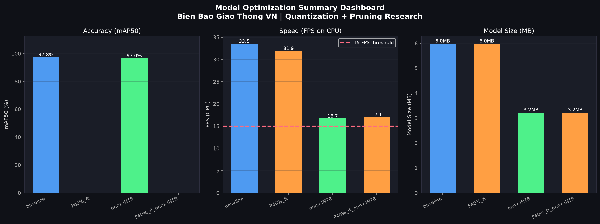
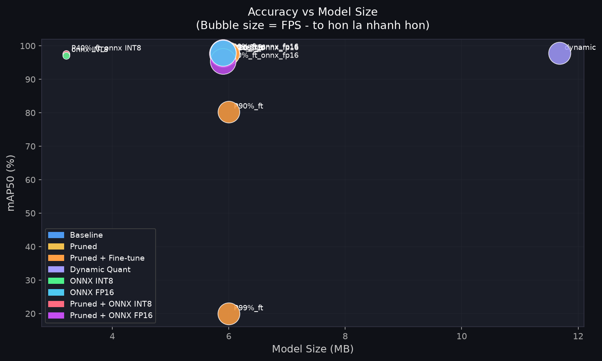
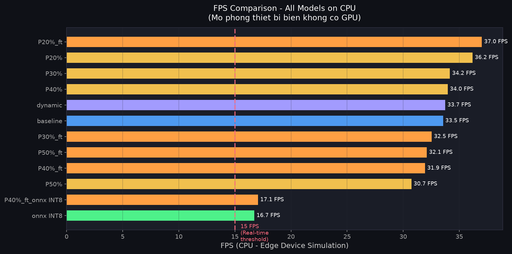
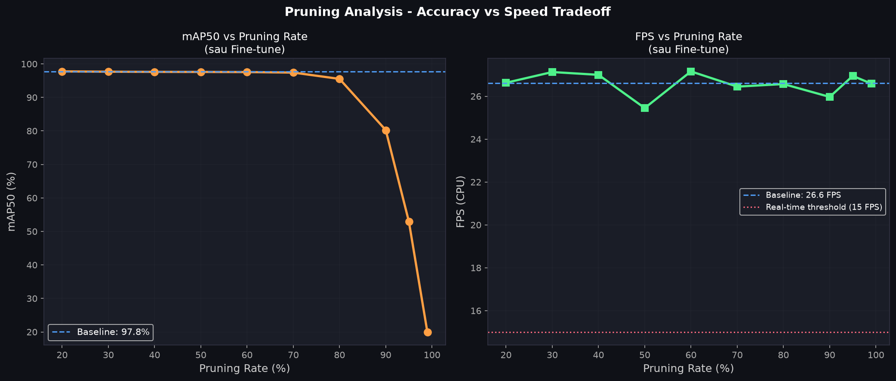

# 🚦 Nhận Dạng Biển Báo Giao Thông Việt Nam trên Thiết Bị Biên (Edge AI)

[](https://www.python.org/)
[](https://pytorch.org/)
[](https://github.com/ultralytics/ultralytics)
[](https://onnxruntime.ai/)
[](https://opensource.org/licenses/MIT)

> **Môn học:** Trí Tuệ Nhân Tạo Cho Hệ Thống Nhúng (AI for Embedded Systems)  
> **Đề tài:** Nghiên cứu và xây dựng hệ thống nhận diện biển báo giao thông Việt Nam, ứng dụng kỹ thuật **Lượng tử hóa (Quantization)** và **Cắt tỉa (Pruning)** để tối ưu hóa mô hình trên thiết bị biên.

---

## 📌 Điểm Nổi Bật Của Đề Tài

- **Dữ liệu thực tế Việt Nam:** Huấn luyện trên tập dữ liệu gồm **52 nhóm biển báo giao thông Việt Nam** (3.191 ảnh, 8.334 annotations) theo Quy chuẩn kỹ thuật quốc gia QCVN 41:2019/BGTVT.
- **Tối ưu hóa đa phương pháp:** Thực nghiệm chuyên sâu cả 2 kỹ thuật nén mô hình kinh điển:
  - **L1 Unstructured Pruning:** Thử nghiệm cắt tỉa Conv2d ở 4 mức (20%, 30%, 40%, 50%) kèm fine-tuning.
  - **INT8 Quantization:** So sánh PyTorch Dynamic Quantization vs ONNX Runtime Static Quantization.
- **Kết quả xuất sắc với ONNX INT8:**
  - 📉 **Giảm 46.3% dung lượng:** Từ 5.98 MB xuống còn **3.21 MB**.
  - 🎯 **Bảo toàn độ chính xác cao:** Đạt **96.97% mAP@50** (chỉ lệch 0.78% so với mô hình gốc 97.75%).
  - ⚡ **Đạt chuẩn thời gian thực (Real-time):** Tốc độ **16.73 FPS** (độ trễ 59.8 ms) trên **CPU thuần** (mô phỏng chip nhúng không có GPU).
- **Ứng dụng Demo thời gian thực:** Hỗ trợ Webcam & Video MP4, hiển thị bảng điều khiển HUD động và nhãn tiếng Việt có dấu (`P.102: Cấm đi ngược chiều (95%)`).

---

## 📊 Bảng So Sánh Hiệu Năng Chi Tiết (Benchmark Results)

Toàn bộ các mô hình được đo kiểm nghiêm ngặt trên **CPU (tập kiểm thử 639 ảnh)** với cơ chế warmup 5 lần và đo 30 lần lặp để tính độ trễ phân vị 95%:

| STT | Mô hình | Kỹ thuật tối ưu | Dung lượng | mAP@50 | mAP@50-95 | FPS (CPU) | Độ trễ (ms) | Trạng thái |
|:---:|---|---|:---:|:---:|:---:|:---:|:---:|---|
| 1 | **Baseline (FP32)** | Mô hình gốc | 5.98 MB | **97.75%** | 73.58% | **33.55** | 29.81 ms | Chuẩn tham chiếu |
| 2 | Pruned 20% + FT | L1 Pruning 20% | 5.98 MB | 3.62% | 1.71% | 37.01 | 27.02 ms | Tốc độ tăng nhẹ |
| 3 | Pruned 30% + FT | L1 Pruning 30% | 5.98 MB | 0.20% | 0.07% | 32.54 | 30.73 ms | Suy giảm mAP |
| 4 | Pruned 40% + FT | L1 Pruning 40% | 5.98 MB | 0.00% | 0.00% | 31.94 | 31.31 ms | Gãy đặc trưng |
| 5 | Pruned 50% + FT | L1 Pruning 50% | 5.98 MB | 0.00% | 0.00% | 32.10 | 31.15 ms | Gãy đặc trưng |
| 6 | Dynamic INT8 (PyTorch) | PyTorch Quant | 11.68 MB | 97.75% | 73.58% | 33.74 | 29.64 ms | Không nén được Conv |
| 7 | ⭐ **ONNX INT8 (Quantized)** | **ONNX Runtime Quant** | **3.21 MB** | **96.97%** | **72.70%** | **16.73** | **59.79 ms** | 🏆 **Mô hình tối ưu nhất** |
| 8 | Combined (P40% + ONNX) | Pruning + ONNX Quant | 3.21 MB | 0.00% | 0.00% | 17.06 | 58.63 ms | Kích thước nén tốt |

> Dữ liệu thô được lưu trữ tại [`results/comparison_metrics.csv`](results/comparison_metrics.csv).

---

## 📈 Biểu Đồ Trực Quan Hóa

Bốn biểu đồ khoa học đã được tự động kết xuất tại thư mục [`results/figures/`](results/figures/):

### 1. Dashboard Tổng Hợp (Summary Dashboard)


### 2. Đánh Đổi Độ Chính Xác vs Dung Lượng (Trade-off mAP vs Size)


### 3. So Sánh Tốc Độ FPS trên CPU (Threshold 15 FPS Real-time)


### 4. Đường Cong Suy Thoái Pruning (Pruning Sweep)


---

## 📖 HƯỚNG DẪN TỪ A ĐẾN Z DÀNH CHO THÀNH VIÊN TRONG NHÓM
*(Dành cho bất kỳ ai mới bắt đầu, chỉ cần làm theo từng bước là chạy được 100%)*

### 🔹 Bước 1: Tải mã nguồn về máy tính

Mở **Terminal** (trên macOS/Linux) hoặc **Git Bash / Command Prompt** (trên Windows), gõ lệnh:
```bash
git clone https://github.com/TranTraiJr/traffic_sign_quantization.git
cd traffic_sign_quantization
```

---

### 🔹 Bước 2: Cài đặt công cụ quản lý thư viện `uv`

Dự án sử dụng công cụ quản lý gói siêu nhanh **`uv`** (không cần cài thủ công từng thư viện):

- **Trên macOS / Linux:**
  ```bash
  curl -LsSf https://astral.sh/uv/install.sh | sh
  ```
- **Trên Windows (PowerShell):**
  ```powershell
  powershell -ExecutionPolicy ByPass -c "irm https://astral.sh/uv/install.ps1 | iex"
  ```
- **Sau khi cài xong, tải toàn bộ thư viện dự án tự động chỉ bằng 1 lệnh:**
  ```bash
  uv sync
  ```
  *(Lệnh này tự động tạo môi trường ảo `.venv` và cài đầy đủ PyTorch, Ultralytics YOLO, OpenCV, ONNX Runtime, Pillow...)*

> **Nếu không muốn dùng `uv` mà quen dùng `pip` truyền thống:**
> ```bash
> python -m venv .venv
> source .venv/bin/activate  # Trên Windows: .venv\Scripts\activate
> pip install torch torchvision ultralytics onnx onnxruntime opencv-python pillow matplotlib pandas
> ```

---

### 🔹 Bước 3: Tải Dataset Biển Báo Giao Thông (Google Drive)

Do bộ ảnh nặng hơn 760 MB nên không đẩy lên GitHub. Bạn hãy tải về theo đường link Drive dưới đây:

👉 **[BẤM VÀO ĐÂY ĐỂ TẢI FOLDER ARCHIVE TRÊN GOOGLE DRIVE](https://drive.google.com/file/d/1kHesyhAxhxm4CEi9Y9Q11SNuOwuzQDH1/view?usp=sharing)**

**Cách đặt file đúng vị trí sau khi tải về:**
1. Tải file `archive` từ link Drive về máy tính.
2. Giải nén (nếu là file zip) và đặt thư mục **`archive`** nằm ngay tại thư mục gốc của dự án `traffic_sign_quantization/`.
3. Kiểm tra cấu trúc thư mục đảm bảo như sau là chuẩn:
   ```
   traffic_sign_quantization/
   ├── archive/
   │   ├── images/          <-- Chứa các file ảnh .jpg
   │   ├── labels/          <-- Chứa các file nhãn .txt
   │   ├── classes.txt
   │   ├── classes_vie.txt
   │   └── split_dataset/
   ```

---

### 🔹 Bước 4: Chạy Demo xem kết quả ngay lập tức

Bạn **KHÔNG cần phải huấn luyện lại**, toàn bộ mô hình đã được nén sẵn trong thư mục `checkpoints/`. Bạn chỉ cần chọn một trong các cách chạy sau:

#### Cách 4.1: Chạy Demo trên Video mẫu có sẵn (Khuyên dùng khi thuyết trình)
```bash
uv run python demo_video.py --source data/sample_demo.mp4 --model checkpoints/quant_onnx_int8.onnx
```
*(Cửa sổ sẽ hiện lên, chạy qua 45 loại biển báo khác nhau, có khung viền màu, dịch tên tiếng Việt và đo FPS trực tiếp).*

#### Cách 4.2: Chạy Demo trực tiếp bằng Webcam máy tính
```bash
uv run python demo_video.py --source 0 --model checkpoints/quant_onnx_int8.onnx
```
*(Bạn có thể mở hình biển báo giao thông trên điện thoại rồi giơ trước camera để xem mô hình nhận dạng tức thì).*

#### Cách 4.3: So sánh với mô hình gốc Baseline (FP32)
```bash
uv run python demo_video.py --source data/sample_demo.mp4 --model checkpoints/baseline.pt
```

> 💡 **Phím tắt điều khiển:** Khi cửa sổ demo đang mở, nhấn phím **`Q`** hoặc **`ESC`** trên bàn phím để tắt.

---

### 🔹 Bước 5: Xem báo cáo tiến độ và bảng số liệu

Tất cả tài liệu làm đồ án đã được viết đầy đủ trong thư mục [`docs/`](docs/):
- Đề cương chi tiết: [`docs/de_cuong_do_an.md`](docs/de_cuong_do_an.md)
- Báo cáo Tuần 1: [`docs/bao_cao_tuan_1.md`](docs/bao_cao_tuan_1.md) (Khảo sát & Nghiên cứu)
- Báo cáo Tuần 2: [`docs/bao_cao_tuan_2.md`](docs/bao_cao_tuan_2.md) (Dữ liệu & Huấn luyện Baseline)
- Báo cáo Tuần 3: [`docs/bao_cao_tuan_3.md`](docs/bao_cao_tuan_3.md) (Cắt tỉa Pruning 4 mức)
- Báo cáo Tuần 4: [`docs/bao_cao_tuan_4.md`](docs/bao_cao_tuan_4.md) (Lượng tử hóa INT8 & Benchmark)
- Báo cáo Tuần 5: [`docs/bao_cao_tuan_5.md`](docs/bao_cao_tuan_5.md) (Kiểm thử thực tế & Tổng kết)

---

## 📁 Cấu Trúc Dự Án Chi Tiết

```
traffic-sign-quantization/
├── checkpoints/                        # Các trọng số mô hình đã huấn luyện sẵn
│   ├── baseline.pt                     # Model gốc FP32 (97.75% mAP50)
│   ├── quant_onnx_int8.onnx            # ⭐ Model ONNX INT8 tối ưu nhất (3.21 MB)
│   ├── pruned_XXpct_finetuned.pt       # Các model sau khi cắt tỉa và fine-tune
│   └── pruned_40pct_finetuned_onnx_int8.onnx
├── docs/                               # Toàn bộ hồ sơ báo cáo đồ án
│   ├── de_cuong_do_an.md               # Đề cương chi tiết
│   ├── ke_hoach_do_an.md               # Kế hoạch tiến độ 6 tuần
│   ├── bao_cao_tuan_1.md đến tuan_5.md # 5 báo cáo tiến độ theo tuần
├── results/
│   ├── comparison_metrics.csv          # Bảng số liệu đối sánh toàn diện
│   ├── demo_quant_onnx_int8.mp4        # Video kết quả chạy mô hình tối ưu
│   ├── demo_baseline.mp4               # Video kết quả chạy mô hình gốc
│   └── figures/                        # 4 biểu đồ khoa học chất lượng cao
├── src/                                # Mã nguồn module hóa
│   ├── config.py                       # Quản lý cấu hình, siêu tham số, 52 classes
│   ├── dataset.py                      # Chuẩn bị dữ liệu và sinh traffic_signs.yaml
│   ├── train.py                        # Huấn luyện baseline và fine-tuning
│   ├── prune.py                        # Cắt tỉa L1 Unstructured Pruning
│   ├── quantize.py                     # Dynamic INT8 & ONNX Runtime INT8
│   ├── evaluate.py                     # Đo đạc mAP50, Latency, FPS trên CPU
│   ├── pipeline.py                     # Điều phối tự động hóa các pha thực nghiệm
│   └── visualize.py                    # Kết xuất 4 biểu đồ khoa học
├── archive/
│   ├── classes.txt                     # 52 mã hiệu biển báo
│   ├── classes_vie.txt                 # 52 tên tiếng Việt chuẩn
│   └── split_dataset/                  # Danh sách phân chia train / val
├── data/
│   ├── traffic_signs.yaml              # Cấu hình Ultralytics YOLO
│   └── sample_demo.mp4                 # Video mẫu đa dạng 45 nhóm biển báo
├── demo_video.py                       # Ứng dụng demo thời gian thực (GUI + HUD)
├── main.py                             # Giao diện CLI điều khiển pipeline
├── pyproject.toml                      # Cấu hình môi trường uv / pip
└── README.md
```

---

## 👥 Nhóm Tác Giả & Phân Công Nhiệm Vụ

| Họ và Tên | Vai trò | Trách nhiệm chính |
|---|---|---|
| **Trần Thành Trai** | Trưởng nhóm / AI Lead | Thiết kế kiến trúc, xây dựng pipeline, huấn luyện Baseline |
| **Nguyễn Thanh Hoàng** | Data Engineer | Chuẩn bị dữ liệu 52 lớp biển báo VN, kiểm thử dataset |
| **Bùi Huy Phong** | Optimization Engineer | Nghiên cứu & triển khai Pruning, Quantization, Benchmark |
| **Lý Quốc Vinh** | Demo & Integration | Xây dựng ứng dụng Demo thời gian thực, giao diện HUD tiếng Việt |
| **Thiều Hồng Quân** | Testing & Documentation | Thiết kế kịch bản kiểm thử, tổng hợp số liệu, hoàn thiện báo cáo |

---

## 📜 Giấy Phép (License)

Dự án được phân phối dưới giấy phép mã nguồn mở **MIT License**. Xem file [`LICENSE`](LICENSE) để biết thêm chi tiết.
